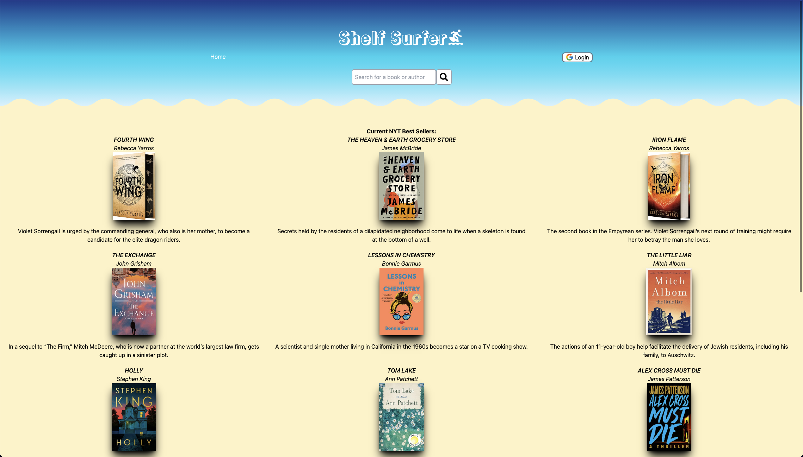
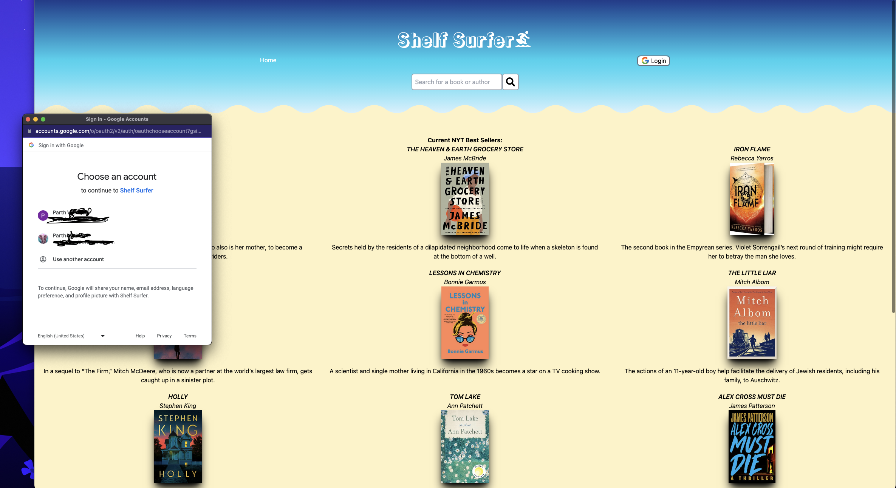
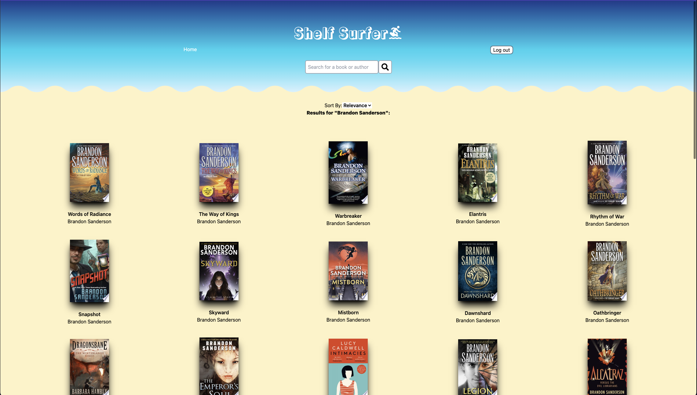
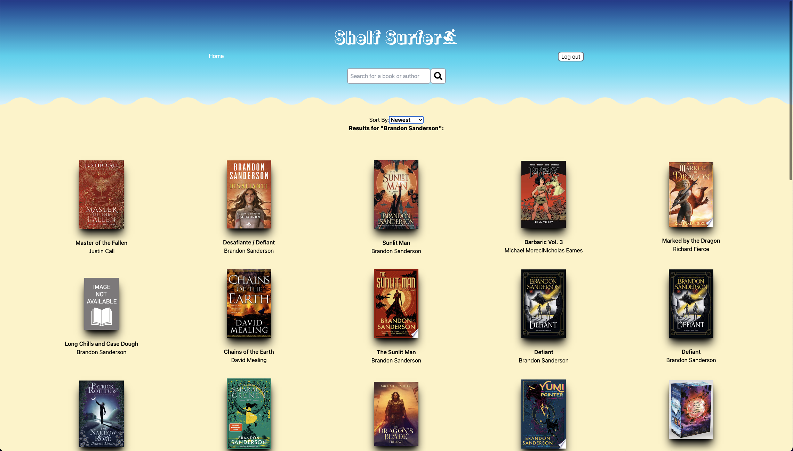
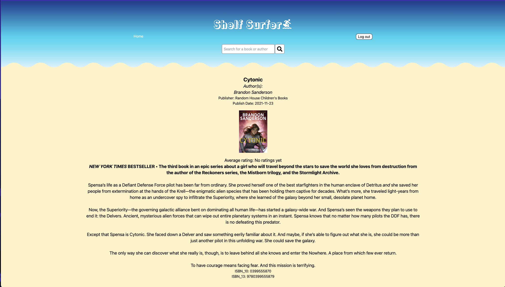

# Shelf Surfer

Welcome to Shelf Surfer! This is an application built entirely in React that is designed to help you find books that you may want to put on your shelf. Thanks to the use of the Google Books API, all you need to do is search for a title or author and an extensive list of results relating to the search term will appear. You can then click on a book to view more details about it, such as the publisher, the summary, and even the ISBN numbers. 

## User Flow

Home Page\

Login Screen\

Search Results sorted by Relevance\

Search Results sorted by Newest\

Seeing More Results\

Book Details Page\

## Technologies Used

React, Tailwind CSS, Netlify, Google Books API, NYTimes Bestsellers API, Google OAuth

## Getting Started

Click on the link below to access the site and start surfing!\
<a href="https://main--shelfsurfer.netlify.app/">ShelfSurfer</a>

Here's a link to the planning materials used when designing the app: <a href="https://trello.com/b/orFoETy0/sei-project-3-book-finder-app">Shelf Surfer Planning</a>

## Next Steps

Future iterations of this app are planned for implementation, however they will first require the app to be refactored into a full MERN-Stack application. After that is complete the future planned implementations are as follows:

- Improve upon the Google OAuth implementation to keep users signed in across sessions and reloads
- Use the information pulled from Google OAuth to build a profile page for the user
- Allow the user to store books in different lists on their profile ("Have Read", "Currently Reading", "Plan to Read", etc.)
- Allow the user to leave reviews for other users to see
- Implement direct links to purchase the book
- Improve the page transition animations to look more like a page turn

## Acknowledgements

Special thanks to LogRocket for the guide on implementing Google OAuth in React